# Spring Batch

- Ch1: 入門 (1~5)
- Ch2: 作業流 (6~12)
- Ch3: 數據輸入 (13~


## 1、入門

### 1.1、L01 - SpringBatch 概述


- Spring Batch 是一個批處理應用框架，`不是調度框架`。需要和調度框架(Quartz、Control-M、...)合作來完成相應的批處理任務。
- Spring Batch 實現批處理是基於任務(Job)的，Job 的執行是由若干個 Step(步驟) 所構成(一個 Job 由一個或多個 Step 所組成)。
- Step 可以實現數據的讀取、處理、輸出。
- Job 可以由 JobLauncher 來進行啟動，在任務的執行過程中和 Job 相關的信息會被持久化到數據庫中，也就是 JobRepository。


### 1.2、L02 -  搭建 Spring Batch 項目

- 使用 spring.io 創建 spring boot maven 項目，並 import 至 IDE 中

  

- 批處理任務執行的相關信息(metadata)需要持久化儲存到資料庫中

  - 未配置數據源專案會啟動失敗

  ```
  Error starting ApplicationContext. To display the conditions report re-run your application with 'debug' enabled.
  2021-05-04 21:39:53.562 ERROR 13604 --- [           main] o.s.b.d.LoggingFailureAnalysisReporter   : 
  
  ***************************
  APPLICATION FAILED TO START
  ***************************
  
  Description:
  
  Failed to configure a DataSource: 'url' attribute is not specified and no embedded datasource could be configured.
  
  Reason: Failed to determine a suitable driver class
  
  
  Action:
  
  Consider the following:
  	If you want an embedded database (H2, HSQL or Derby), please put it on the classpath.
  	If you have database settings to be loaded from a particular profile you may need to activate it (no profiles are currently active).
  ```

  

- pom.xml

  ```xml
  		<dependency>
  			<groupId>org.springframework.boot</groupId>
  			<artifactId>spring-boot-starter-batch</artifactId>
  		</dependency>
  ```
  
  
  
  ```xml
  		<dependency>
  			<groupId>com.h2database</groupId>
  			<artifactId>h2</artifactId>
  			<scope>runtime</scope>
  		</dependency>
  ```
  
  或
  
  ```xml
          <dependency>
              <groupId>org.hsqldb</groupId>
              <artifactId>hsqldb</artifactId>
              <scope>runtime</scope>
          </dependency>
  ```
  
  

### 1.3、L03 -  創建 Spring Batch 入門程序

- 創一個  Config 類 (@Configuration) 並加上 Batch 註解 `@EnableBatchProcessing`。

  ```java
  @Configuration
  @EnableBatchProcessing
  public class JobConfig {
  	// 注入創建任務對象的對象。
  	@Autowired
  	private JobBuilderFactory jobBuilderFactory;
  	// 任務的執行由 Step 決定。 (一個任務可以包含多個 step)
  	// 注入創建 Step 對象的對象。
  	@Autowired
  	private StepBuilderFactory stepBuilderFactory;
  
  	/**
  	 * 創建任務對象。
  	 */
  	@Bean
  	public Job helloWorldJob() {
  		return jobBuilderFactory
  				// 任務名稱: helloWorldJob
  				.get("helloWorldJob")
  				// 指定任務開始執行的 step
  				.start(step1())
  				.build();
  	}
  
  	@Bean
  	public Step step1() {
  		return stepBuilderFactory
  				// Step 名稱: step1
  				.get("step1")
  				// 指定 step 實現的功能 (tasklet 或 chunk)
  				.tasklet(new Tasklet() {
  
  					@Override
  					public RepeatStatus execute(StepContribution contribution, ChunkContext chunkContext)
  							throws Exception {
  						// Step 具體的執行內容
  						System.out.println("Hello World!");
  
  						// 指定 Step 執行完後的狀態。 (後面可能還有其他 step，所以前一個 step 的狀態可能會決定後面會不會繼續執行)
  						return RepeatStatus.FINISHED;
  					}
  				}).build();
  	}
  }
  ```

  

- 執行啟動類即可執行任務。

  ```
  2022-05-18 16:43:30.915  INFO 19672 --- [           main] o.s.b.a.b.JobLauncherApplicationRunner   : Running default command line with: []
  2022-05-18 16:43:31.012  INFO 19672 --- [           main] o.s.b.c.l.support.SimpleJobLauncher      : Job: [SimpleJob: [name=helloWorldJob]] launched with the following parameters: [{}]
  2022-05-18 16:43:31.042  INFO 19672 --- [           main] o.s.batch.core.job.SimpleStepHandler     : Executing step: [step1]
  Hello World!
  2022-05-18 16:43:31.054  INFO 19672 --- [           main] o.s.batch.core.step.AbstractStep         : Step: [step1] executed in 11ms
  2022-05-18 16:43:31.061  INFO 19672 --- [           main] o.s.b.c.l.support.SimpleJobLauncher      : Job: [SimpleJob: [name=helloWorldJob]] completed with the following parameters: [{}] and the following status: [COMPLETED] in 29ms
  ```

  

### 1.4、L04 - 替換為 MySQL 數據庫

- pom.xml

  ```xml
  		<dependency>
  			<groupId>mysql</groupId>
  			<artifactId>mysql-connector-java</artifactId>
  			<scope>runtime</scope>
  		</dependency>
  
  		<dependency>
  			<groupId>org.springframework.boot</groupId>
  			<artifactId>spring-boot-starter-jdbc</artifactId>
  			<scope>runtime</scope>
  		</dependency>
  ```

- application.properties

  ```properties
  # Loading class `com.mysql.jdbc.Driver'. This is deprecated. The new driver class is `com.mysql.cj.jdbc.Driver'. The driver is automatically registered via the SPI and manual loading of the driver class is generally unnecessary.
  spring.datasource.driverClassName=com.mysql.jdbc.Driver
  spring.datasource.url=jdbc:mysql://localhost:3306/SPRING_BATCH
  spring.datasource.username=test
  spring.datasource.password=test
  # C:\Users\user\.m2\repository\org\springframework\batch\spring-batch-core\4.3.2\spring-batch-core-4.3.2.jar
  spring.datasource.schema=classpath:/org/springframework/batch/core/schema-mysql.sql
  # spring batch 初始化時執行 schema-mysql.sql
  spring.batch.initialize-schema=always
  ```

- spring batch ER-diagram

  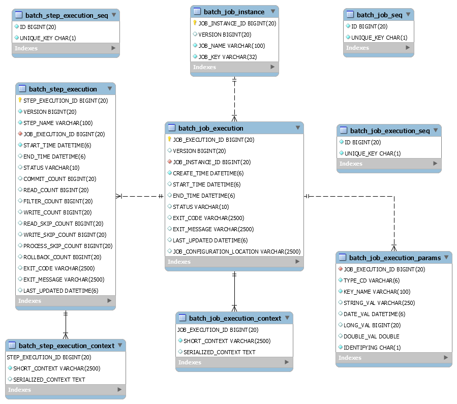

- 其他

> https://dev.mysql.com/doc/connector-j/5.1/en/connector-j-versions.html
>
> 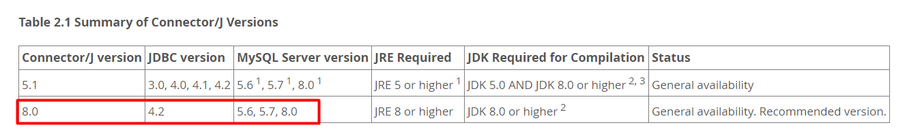


### 1.5、L05 - 核心 API

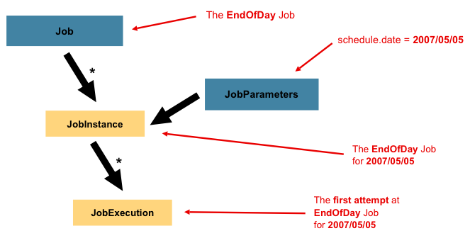

- JobInstance
  - JobInstance 和 Job 的關係如同 Java 中實例與類的關係。
  - Job 定義了一個工作流程，JobInstance 就是該工作流程的一個具體實例。
  - 一個 Job 可以有多個 JobInstance 

- JobParameters:
  - 不同的 JobParameters 配置將產生不同的JobInstance。
  - 使用相同的 JobParameters 運行同一 Job，會重複使用上一個 JobInstance
  - 可以初步理解為 **JobInstance = Job + JobParameters** 

- JobExecution:
  - 表示 JobInstance 的一次運行
  - 每次 JobInstance 的運行都會產生 1 個 JobExecution (包含 運行時間、狀態成功與否、...)
- StepExecution:
  - 類似於 JobExecution，表示 Step 的一次運行
- ExecutionContext
  - 表示每一個 StepExecution 的執行內容。包含開發人員需要在批處理執行中保留的任何資料，例如重新啟動所需的統計資訊或狀態資訊。


## 2、作業流

### 2.1、L06 - Job 的創建和使用

- Job: 作業。批處理中的核心概念，是Batch操作的基礎單元。
- 每個作業(Job)有 1 個或者多個作業步驟(Step)


### 2.2、L07 - Flow 的創建和使用

1. Flow 是多個 Step 的集合
2. 可以被多個 Job 複用
3. 使用 FlowBuilder 來創建

> 可以組裝若干個 Step 成為一個 flow 給多個不同的 Job 複用。


### 2.3、L08 - split 實現併發執行

實現任務中的多個step或多個flow併發執行

1. 創建若干個step
2. 創建兩個flow
3. 創建一個任務包含以上兩個flow，並讓這兩個 flow 併發執行

```
2022-05-19 18:43:12.904  INFO 20508 --- [           main] o.s.b.c.l.support.SimpleJobLauncher      : Job: [FlowJob: [name=splitDemoJob]] launched with the following parameters: [{}]
2022-05-19 18:43:12.965  INFO 20508 --- [cTaskExecutor-2] o.s.batch.core.job.SimpleStepHandler     : Executing step: [splitDemoStep1]
2022-05-19 18:43:12.987  INFO 20508 --- [cTaskExecutor-1] o.s.batch.core.job.SimpleStepHandler     : Executing step: [splitDemoStep2]
splitDemoStep1
splitDemoStep2
2022-05-19 18:43:13.007  INFO 20508 --- [cTaskExecutor-2] o.s.batch.core.step.AbstractStep         : Step: [splitDemoStep1] executed in 42ms
2022-05-19 18:43:13.023  INFO 20508 --- [cTaskExecutor-1] o.s.batch.core.step.AbstractStep         : Step: [splitDemoStep2] executed in 36ms
2022-05-19 18:43:13.048  INFO 20508 --- [cTaskExecutor-1] o.s.batch.core.job.SimpleStepHandler     : Executing step: [splitDemoStep3]
splitDemoStep3
2022-05-19 18:43:13.073  INFO 20508 --- [cTaskExecutor-1] o.s.batch.core.step.AbstractStep         : Step: [splitDemoStep3] executed in 25ms
2022-05-19 18:43:13.097  INFO 20508 --- [           main] o.s.b.c.l.support.SimpleJobLauncher      : Job: [FlowJob: [name=splitDemoJob]] completed with the following parameters: [{}] and the following status: [COMPLETED] in 170ms
```

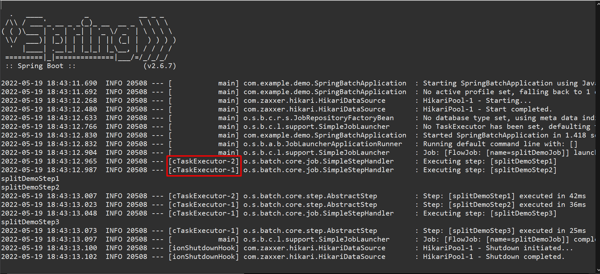


### 2.4、L09 - 決策器的使用

接口: JobExecutionDecider


> on() 方法沒辦法滿足比較複雜的條件


### 2.5、L10 - Job 的嵌套

一個 Job 可以嵌套在另一個 Job 中，被嵌套的 Job 稱為子Job，外部Job稱為父Job。子 Job 不能單獨執行，需要由父Job來啟動。

- 案例: 創建兩個 Job，一個作為子 Job，再創建一個 Job 作為父 Job。


### 2.6、L11 - 監聽器的使用

用來監聽批處理作業的執行情況
創建監聽可以通過實現接口或使用注解
(不僅限於監聽 Job)

- 不同的監聽，以及觸發時機

  ```
  JobExecutionListener(before,after)
  StepExecutionListener(before,after)
  ChunkListener(before,after,error)
  ItemReadListener,ItemProcessListener,ItemWriteListener(before,after,error)
  ```


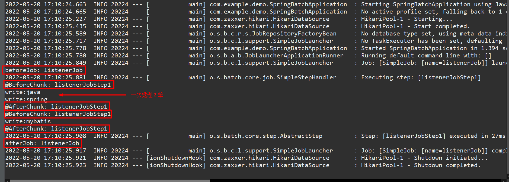


### 2.7、L12 - Job 參數

在 Job 運行時可以用 `key=value` 形式傳遞參數


程式執行時傳外部 program arguments

```
--info=MyInformation
```


## 3、數據輸入

### 3.1、L13 - ItemReader 概述


### 3.2、L14 - 從數據庫中讀取數據

使用 JdbcPagingItemReader (ItemReader 的一個子類) 實現


### 3.3、L15 - 從普通文件讀取數據

使用 FlatFileItemReader 實現


### 3.4、L16 - 從 XML 文件中讀取數據

使用 StaxEventItemReader


- pom.xml

  ```xml
  		<dependency>
  			<groupId>org.springframework</groupId>
  			<artifactId>spring-oxm</artifactId>
  		</dependency>
  		<dependency>
  			<groupId>com.thoughtworks.xstream</groupId>
  			<artifactId>xstream</artifactId>
  			<version>1.4.19</version>
  		</dependency>
  ```


### 3.5、L17 - 從多個文件中讀取數據

使用 MultiResourceItemReader


### 3.6、L18 - ItemReader 異常處理及重啟

ItemReader 讀取數據時發生異常該如何處理?

發生異常 -> 任務結束 -> Spring Batch 提供的解決方案為何?

實現 ItemStreamReader 接口 (ItemStream + ItemReader)


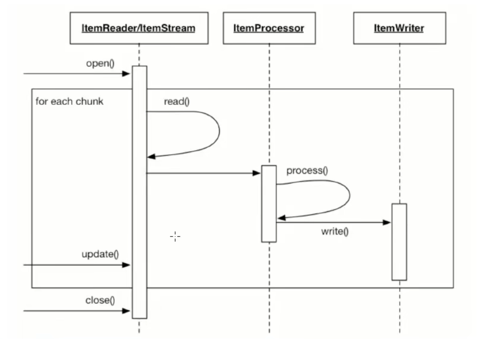

#### 實際演示效果

- restart.txt

  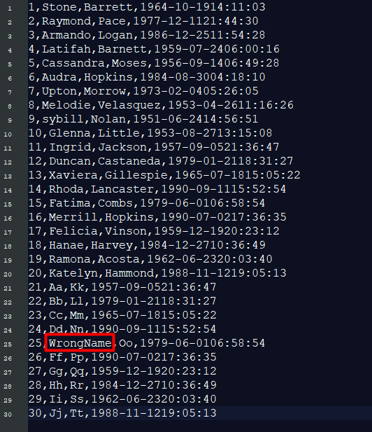

  ```
  1,Stone,Barrett,1964-10-1914:11:03
  2,Raymond,Pace,1977-12-1121:44:30
  3,Armando,Logan,1986-12-2511:54:28
  4,Latifah,Barnett,1959-07-2406:00:16
  5,Cassandra,Moses,1956-09-1406:49:28
  6,Audra,Hopkins,1984-08-3004:18:10
  7,Upton,Morrow,1973-02-0405:26:05
  8,Melodie,Velasquez,1953-04-2611:16:26
  9,sybill,Nolan,1951-06-2414:56:51
  10,Glenna,Little,1953-08-2713:15:08
  11,Ingrid,Jackson,1957-09-0521:36:47
  12,Duncan,Castaneda,1979-01-2118:31:27
  13,Xaviera,Gillespie,1965-07-1815:05:22
  14,Rhoda,Lancaster,1990-09-1115:52:54
  15,Fatima,Combs,1979-06-0106:58:54
  16,Merri1l,Hopkins,1990-07-0217:36:35
  17,Felicia,Vinson,1959-12-1920:23:12
  18,Hanae,Harvey,1984-12-2710:36:49
  19,Ramona,Acosta,1962-06-2320:03:40
  20,Katelyn,Hammond,1988-11-1219:05:13
  21,Aa,Kk,1957-09-0521:36:47
  22,Bb,Ll,1979-01-2118:31:27
  23,Cc,Mm,1965-07-1815:05:22
  24,Dd,Nn,1990-09-1115:52:54
  25,WrongName,Oo,1979-06-0106:58:54
  26,Ff,Pp,1990-07-0217:36:35
  27,Gg,Qq,1959-12-1920:23:12
  28,Hh,Rr,1984-12-2710:36:49
  29,Ii,Ss,1962-06-2320:03:40
  30,Jj,Tt,1988-11-1219:05:13
  ```

- 第一次執行

  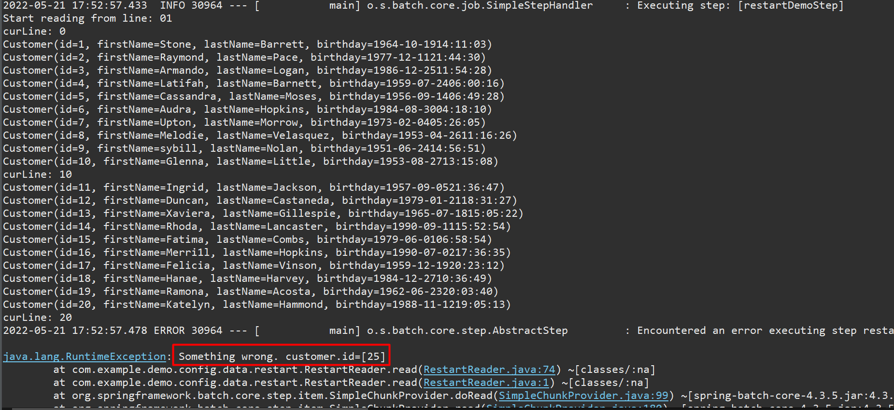

  ```
  2022-05-21 17:52:57.298  INFO 30964 --- [           main] o.s.b.a.b.JobLauncherApplicationRunner   : Running default command line with: [info=MyInformation]
  2022-05-21 17:52:57.384  INFO 30964 --- [           main] o.s.b.c.l.support.SimpleJobLauncher      : Job: [SimpleJob: [name=restartDemoJob]] launched with the following parameters: [{info=MyInformation}]
  2022-05-21 17:52:57.433  INFO 30964 --- [           main] o.s.batch.core.job.SimpleStepHandler     : Executing step: [restartDemoStep]
  Start reading from line: 01
  curLine: 0
  Customer(id=1, firstName=Stone, lastName=Barrett, birthday=1964-10-1914:11:03)
  Customer(id=2, firstName=Raymond, lastName=Pace, birthday=1977-12-1121:44:30)
  Customer(id=3, firstName=Armando, lastName=Logan, birthday=1986-12-2511:54:28)
  Customer(id=4, firstName=Latifah, lastName=Barnett, birthday=1959-07-2406:00:16)
  Customer(id=5, firstName=Cassandra, lastName=Moses, birthday=1956-09-1406:49:28)
  Customer(id=6, firstName=Audra, lastName=Hopkins, birthday=1984-08-3004:18:10)
  Customer(id=7, firstName=Upton, lastName=Morrow, birthday=1973-02-0405:26:05)
  Customer(id=8, firstName=Melodie, lastName=Velasquez, birthday=1953-04-2611:16:26)
  Customer(id=9, firstName=sybill, lastName=Nolan, birthday=1951-06-2414:56:51)
  Customer(id=10, firstName=Glenna, lastName=Little, birthday=1953-08-2713:15:08)
  curLine: 10
  Customer(id=11, firstName=Ingrid, lastName=Jackson, birthday=1957-09-0521:36:47)
  Customer(id=12, firstName=Duncan, lastName=Castaneda, birthday=1979-01-2118:31:27)
  Customer(id=13, firstName=Xaviera, lastName=Gillespie, birthday=1965-07-1815:05:22)
  Customer(id=14, firstName=Rhoda, lastName=Lancaster, birthday=1990-09-1115:52:54)
  Customer(id=15, firstName=Fatima, lastName=Combs, birthday=1979-06-0106:58:54)
  Customer(id=16, firstName=Merri1l, lastName=Hopkins, birthday=1990-07-0217:36:35)
  Customer(id=17, firstName=Felicia, lastName=Vinson, birthday=1959-12-1920:23:12)
  Customer(id=18, firstName=Hanae, lastName=Harvey, birthday=1984-12-2710:36:49)
  Customer(id=19, firstName=Ramona, lastName=Acosta, birthday=1962-06-2320:03:40)
  Customer(id=20, firstName=Katelyn, lastName=Hammond, birthday=1988-11-1219:05:13)
  curLine: 20
  2022-05-21 17:52:57.478 ERROR 30964 --- [           main] o.s.batch.core.step.AbstractStep         : Encountered an error executing step restartDemoStep in job restartDemoJob
  
  java.lang.RuntimeException: Something wrong. customer.id=[25]
  	at com.example.demo.config.data.restart.RestartReader.read(RestartReader.java:74) ~[classes/:na]
  	at com.example.demo.config.data.restart.RestartReader.read(RestartReader.java:1) ~[classes/:na]
  	at org.springframework.batch.core.step.item.SimpleChunkProvider.doRead(SimpleChunkProvider.java:99) ~[spring-batch-core-4.3.5.jar:4.3.5]
  	at org.springframework.batch.core.step.item.SimpleChunkProvider.read(SimpleChunkProvider.java:180) ~[spring-batch-core-4.3.5.jar:4.3.5]
  	at org.springframework.batch.core.step.item.SimpleChunkProvider$1.doInIteration(SimpleChunkProvider.java:126) ~[spring-batch-core-4.3.5.jar:4.3.5]
  	at org.springframework.batch.repeat.support.RepeatTemplate.getNextResult(RepeatTemplate.java:375) ~[spring-batch-infrastructure-4.3.5.jar:4.3.5]
  	at org.springframework.batch.repeat.support.RepeatTemplate.executeInternal(RepeatTemplate.java:215) ~[spring-batch-infrastructure-4.3.5.jar:4.3.5]
  	at org.springframework.batch.repeat.support.RepeatTemplate.iterate(RepeatTemplate.java:145) ~[spring-batch-infrastructure-4.3.5.jar:4.3.5]
  	at org.springframework.batch.core.step.item.SimpleChunkProvider.provide(SimpleChunkProvider.java:118) ~[spring-batch-core-4.3.5.jar:4.3.5]
  	at org.springframework.batch.core.step.item.ChunkOrientedTasklet.execute(ChunkOrientedTasklet.java:71) ~[spring-batch-core-4.3.5.jar:4.3.5]
  	at org.springframework.batch.core.step.tasklet.TaskletStep$ChunkTransactionCallback.doInTransaction(TaskletStep.java:407) ~[spring-batch-core-4.3.5.jar:4.3.5]
  	at org.springframework.batch.core.step.tasklet.TaskletStep$ChunkTransactionCallback.doInTransaction(TaskletStep.java:331) ~[spring-batch-core-4.3.5.jar:4.3.5]
  	at org.springframework.transaction.support.TransactionTemplate.execute(TransactionTemplate.java:140) ~[spring-tx-5.3.19.jar:5.3.19]
  	at org.springframework.batch.core.step.tasklet.TaskletStep$2.doInChunkContext(TaskletStep.java:273) ~[spring-batch-core-4.3.5.jar:4.3.5]
  	at org.springframework.batch.core.scope.context.StepContextRepeatCallback.doInIteration(StepContextRepeatCallback.java:82) ~[spring-batch-core-4.3.5.jar:4.3.5]
  	at org.springframework.batch.repeat.support.RepeatTemplate.getNextResult(RepeatTemplate.java:375) ~[spring-batch-infrastructure-4.3.5.jar:4.3.5]
  	at org.springframework.batch.repeat.support.RepeatTemplate.executeInternal(RepeatTemplate.java:215) ~[spring-batch-infrastructure-4.3.5.jar:4.3.5]
  	at org.springframework.batch.repeat.support.RepeatTemplate.iterate(RepeatTemplate.java:145) ~[spring-batch-infrastructure-4.3.5.jar:4.3.5]
  	at org.springframework.batch.core.step.tasklet.TaskletStep.doExecute(TaskletStep.java:258) ~[spring-batch-core-4.3.5.jar:4.3.5]
  	at org.springframework.batch.core.step.AbstractStep.execute(AbstractStep.java:208) ~[spring-batch-core-4.3.5.jar:4.3.5]
  	at org.springframework.batch.core.job.SimpleStepHandler.handleStep(SimpleStepHandler.java:152) [spring-batch-core-4.3.5.jar:4.3.5]
  	at org.springframework.batch.core.job.AbstractJob.handleStep(AbstractJob.java:413) [spring-batch-core-4.3.5.jar:4.3.5]
  	at org.springframework.batch.core.job.SimpleJob.doExecute(SimpleJob.java:136) [spring-batch-core-4.3.5.jar:4.3.5]
  	at org.springframework.batch.core.job.AbstractJob.execute(AbstractJob.java:320) [spring-batch-core-4.3.5.jar:4.3.5]
  	at org.springframework.batch.core.launch.support.SimpleJobLauncher$1.run(SimpleJobLauncher.java:149) [spring-batch-core-4.3.5.jar:4.3.5]
  	at org.springframework.core.task.SyncTaskExecutor.execute(SyncTaskExecutor.java:50) [spring-core-5.3.19.jar:5.3.19]
  	at org.springframework.batch.core.launch.support.SimpleJobLauncher.run(SimpleJobLauncher.java:140) [spring-batch-core-4.3.5.jar:4.3.5]
  	at sun.reflect.NativeMethodAccessorImpl.invoke0(Native Method) ~[na:1.8.0_171-1-ojdkbuild]
  	at sun.reflect.NativeMethodAccessorImpl.invoke(NativeMethodAccessorImpl.java:62) ~[na:1.8.0_171-1-ojdkbuild]
  	at sun.reflect.DelegatingMethodAccessorImpl.invoke(DelegatingMethodAccessorImpl.java:43) ~[na:1.8.0_171-1-ojdkbuild]
  	at java.lang.reflect.Method.invoke(Method.java:498) ~[na:1.8.0_171-1-ojdkbuild]
  	at org.springframework.aop.support.AopUtils.invokeJoinpointUsingReflection(AopUtils.java:344) [spring-aop-5.3.19.jar:5.3.19]
  	at org.springframework.aop.framework.ReflectiveMethodInvocation.invokeJoinpoint(ReflectiveMethodInvocation.java:198) [spring-aop-5.3.19.jar:5.3.19]
  	at org.springframework.aop.framework.ReflectiveMethodInvocation.proceed(ReflectiveMethodInvocation.java:163) [spring-aop-5.3.19.jar:5.3.19]
  	at org.springframework.batch.core.configuration.annotation.SimpleBatchConfiguration$PassthruAdvice.invoke(SimpleBatchConfiguration.java:128) [spring-batch-core-4.3.5.jar:4.3.5]
  	at org.springframework.aop.framework.ReflectiveMethodInvocation.proceed(ReflectiveMethodInvocation.java:186) [spring-aop-5.3.19.jar:5.3.19]
  	at org.springframework.aop.framework.JdkDynamicAopProxy.invoke(JdkDynamicAopProxy.java:215) [spring-aop-5.3.19.jar:5.3.19]
  	at com.sun.proxy.$Proxy49.run(Unknown Source) [na:na]
  	at org.springframework.boot.autoconfigure.batch.JobLauncherApplicationRunner.execute(JobLauncherApplicationRunner.java:199) [spring-boot-autoconfigure-2.6.7.jar:2.6.7]
  	at org.springframework.boot.autoconfigure.batch.JobLauncherApplicationRunner.executeLocalJobs(JobLauncherApplicationRunner.java:173) [spring-boot-autoconfigure-2.6.7.jar:2.6.7]
  	at org.springframework.boot.autoconfigure.batch.JobLauncherApplicationRunner.launchJobFromProperties(JobLauncherApplicationRunner.java:160) [spring-boot-autoconfigure-2.6.7.jar:2.6.7]
  	at org.springframework.boot.autoconfigure.batch.JobLauncherApplicationRunner.run(JobLauncherApplicationRunner.java:155) [spring-boot-autoconfigure-2.6.7.jar:2.6.7]
  	at org.springframework.boot.autoconfigure.batch.JobLauncherApplicationRunner.run(JobLauncherApplicationRunner.java:150) [spring-boot-autoconfigure-2.6.7.jar:2.6.7]
  	at org.springframework.boot.SpringApplication.callRunner(SpringApplication.java:768) [spring-boot-2.6.7.jar:2.6.7]
  	at org.springframework.boot.SpringApplication.callRunners(SpringApplication.java:758) [spring-boot-2.6.7.jar:2.6.7]
  	at org.springframework.boot.SpringApplication.run(SpringApplication.java:310) [spring-boot-2.6.7.jar:2.6.7]
  	at org.springframework.boot.SpringApplication.run(SpringApplication.java:1312) [spring-boot-2.6.7.jar:2.6.7]
  	at org.springframework.boot.SpringApplication.run(SpringApplication.java:1301) [spring-boot-2.6.7.jar:2.6.7]
  	at com.example.demo.SpringBatchApplication.main(SpringBatchApplication.java:15) [classes/:na]
  
  2022-05-21 17:52:57.483  INFO 30964 --- [           main] o.s.batch.core.step.AbstractStep         : Step: [restartDemoStep] executed in 50ms
  2022-05-21 17:52:57.500  INFO 30964 --- [           main] o.s.b.c.l.support.SimpleJobLauncher      : Job: [SimpleJob: [name=restartDemoJob]] completed with the following parameters: [{info=MyInformation}] and the following status: [FAILED] in 94ms
  ```

- 修改 restart.txt

  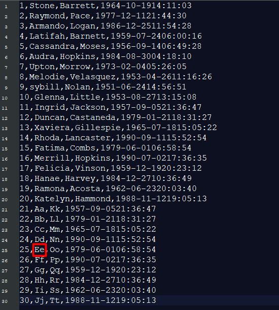

  ```
  1,Stone,Barrett,1964-10-1914:11:03
  2,Raymond,Pace,1977-12-1121:44:30
  3,Armando,Logan,1986-12-2511:54:28
  4,Latifah,Barnett,1959-07-2406:00:16
  5,Cassandra,Moses,1956-09-1406:49:28
  6,Audra,Hopkins,1984-08-3004:18:10
  7,Upton,Morrow,1973-02-0405:26:05
  8,Melodie,Velasquez,1953-04-2611:16:26
  9,sybill,Nolan,1951-06-2414:56:51
  10,Glenna,Little,1953-08-2713:15:08
  11,Ingrid,Jackson,1957-09-0521:36:47
  12,Duncan,Castaneda,1979-01-2118:31:27
  13,Xaviera,Gillespie,1965-07-1815:05:22
  14,Rhoda,Lancaster,1990-09-1115:52:54
  15,Fatima,Combs,1979-06-0106:58:54
  16,Merri1l,Hopkins,1990-07-0217:36:35
  17,Felicia,Vinson,1959-12-1920:23:12
  18,Hanae,Harvey,1984-12-2710:36:49
  19,Ramona,Acosta,1962-06-2320:03:40
  20,Katelyn,Hammond,1988-11-1219:05:13
  21,Aa,Kk,1957-09-0521:36:47
  22,Bb,Ll,1979-01-2118:31:27
  23,Cc,Mm,1965-07-1815:05:22
  24,Dd,Nn,1990-09-1115:52:54
  25,WrongName,Oo,1979-06-0106:58:54
  26,Ff,Pp,1990-07-0217:36:35
  27,Gg,Qq,1959-12-1920:23:12
  28,Hh,Rr,1984-12-2710:36:49
  29,Ii,Ss,1962-06-2320:03:40
  30,Jj,Tt,1988-11-1219:05:13
  ```

- 再次重啟

  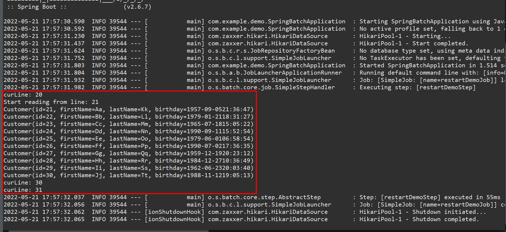

  ```
  2022-05-21 17:57:31.804  INFO 39544 --- [           main] o.s.b.a.b.JobLauncherApplicationRunner   : Running default command line with: [info=MyInformation]
  2022-05-21 17:57:31.932  INFO 39544 --- [           main] o.s.b.c.l.support.SimpleJobLauncher      : Job: [SimpleJob: [name=restartDemoJob]] launched with the following parameters: [{info=MyInformation}]
  2022-05-21 17:57:31.982  INFO 39544 --- [           main] o.s.batch.core.job.SimpleStepHandler     : Executing step: [restartDemoStep]
  curLine: 20
  Start reading from line: 21
  Customer(id=21, firstName=Aa, lastName=Kk, birthday=1957-09-0521:36:47)
  Customer(id=22, firstName=Bb, lastName=Ll, birthday=1979-01-2118:31:27)
  Customer(id=23, firstName=Cc, lastName=Mm, birthday=1965-07-1815:05:22)
  Customer(id=24, firstName=Dd, lastName=Nn, birthday=1990-09-1115:52:54)
  Customer(id=25, firstName=Ee, lastName=Oo, birthday=1979-06-0106:58:54)
  Customer(id=26, firstName=Ff, lastName=Pp, birthday=1990-07-0217:36:35)
  Customer(id=27, firstName=Gg, lastName=Qq, birthday=1959-12-1920:23:12)
  Customer(id=28, firstName=Hh, lastName=Rr, birthday=1984-12-2710:36:49)
  Customer(id=29, firstName=Ii, lastName=Ss, birthday=1962-06-2320:03:40)
  Customer(id=30, firstName=Jj, lastName=Tt, birthday=1988-11-1219:05:13)
  curLine: 30
  curLine: 31
  2022-05-21 17:57:32.037  INFO 39544 --- [           main] o.s.batch.core.step.AbstractStep         : Step: [restartDemoStep] executed in 55ms
  2022-05-21 17:57:32.056  INFO 39544 --- [           main] o.s.b.c.l.support.SimpleJobLauncher      : Job: [SimpleJob: [name=restartDemoJob]] completed with the following parameters: [{info=MyInformation}] and the following status: [COMPLETED] in 102ms
  ```

  


## 4、數據輸出

### 4.1、L19 - ItemWriter 概述

ItemReader 是一個數據一個數據的讀，但 ItemWriter 是一批一批的輸出 (可提高批處理的性能)


### 4.2、L20 - 數據輸出到數據庫

各種實現類：

```
Neo4jltemWriter
MongoltemWriter
RepositoryltemWriter
HibernateltemWriter
JdbcBatchltemWriter
JpaltemWriter
GemfireltemWriter
```

MySQL 可使用 JdbcBatchltemWriter


- customer.txt

  ```
  id,firstName,lastName,birthday
  1,Stone,Barrett,1964-10-19 14:11:03
  2,Raymond,Pace,1977-12-11 21 :44:30
  3,Armando,Logan,1986-12-25 11:54:28
  4,Latifah,Barnett,1959-07-24 06:00:16
  5,Cassandra,Moses,1956-09-14 06:49:28
  6,Audra,Hopkins,1984-08-30 04:18:10
  7,Upton,Morrow,1973-82-04 05:26:05
  8,Melodie,Velasquez,1953-04-26 11:16:26
  9,Sybill,Nolan,1951-06-24 14:56:51
  10,Glenna,Little,1953-08-27 13:15:08
  11,Ingrid,Jackson,1957-09-05 21:36:47
  12,Duncan,Castaneda,1979-01 21 18:31:27
  13,Xaviera,Gillespie,1965-07-18 15:05:22
  14,Rhoda,Lancaster,1990-09-11 15:52:54
  15,Fatima,Combs,1979-06-01 06: 58: 54
  ```

- DB

  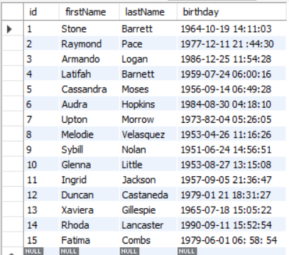


### 4.3、L21 - 數據輸出到普通文件

使用 FlatFileItemWriter

(案例: 從數據庫中讀取數據後寫入到文件)

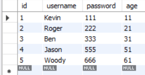

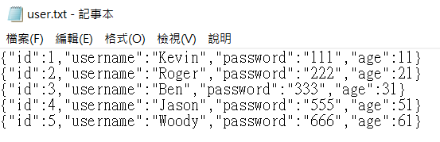
